Container image for picocom - minimal dumb-terminal emulation program

## Usage

### Connect to serial port (baud rate 115200)

```shell
docker run --rm -it --device=/dev/ttyUSB0:/dev/serialport ghcr.io/r-xs-fi/picocom --baud=115200
```

Outputs:
```console
picocom v3.1

port is        : /dev/serialport
flowcontrol    : none
baudrate is    : 115200
parity is      : none
databits are   : 8
stopbits are   : 1
escape is      : C-a
local echo is  : no
noinit is      : no
noreset is     : no
hangup is      : no
nolock is      : no
send_cmd is    : sz -vv
receive_cmd is : rz -vv -E
imap is        :
omap is        :
emap is        : crcrlf,delbs,
logfile is     : none
initstring     : none
exit_after is  : not set
exit is        : no

Type [C-a] [C-h] to see available commands
Terminal ready
```

Tips:

- press `ctrl` + `a` and then `ctrl` + `q` to disconnect


## Supported platforms


| OS    | Architecture  | Supported | Example hardware |
|-------|---------------|-----------|-------------|
| Linux | amd64 | ✅       | Regular PCs (also known as x64-64) |
| Linux | arm64 | ✅       | Raspberry Pi with 64-bit OS, other single-board computers, Apple M1 etc. |
| Linux | arm/v7 | ✅       | Raspberry Pi with 32-bit OS, older phones |
| Linux | riscv64 | ✅       | More exotic hardware |

## How does this software get to me?

```mermaid
flowchart TD
    subgraph "Origin"
        sourcerepo["Original source repo"]
    end
    subgraph "Alpine infrastructure"
        Alpine_build[Alpine build machine]
        Alpine_package[Alpine package registry: picocom 🔗]

        click Alpine_package "https://pkgs.alpinelinux.org/package/edge/community/x86/picocom"
    end
    subgraph "Packaging build"
        rxsfi_build["r.xs.fi build (GitHub Actions)"]
    end
    subgraph "Container Registry"
        r_xs_fi_package_registry[ghcr.io/r-xs-fi/picocom 🔗]

        click r_xs_fi_package_registry "https://ghcr.io/r-xs-fi/picocom"
    end
    subgraph "user"
        docker_run[$ docker run ...]
    end
    sourcerepo -- downloads --> Alpine_build -- stores --> Alpine_package
    Alpine_package -- download --> rxsfi_build
    rxsfi_build -- push --> r_xs_fi_package_registry
    r_xs_fi_package_registry -- pull --> docker_run[$ docker run ...]

```


